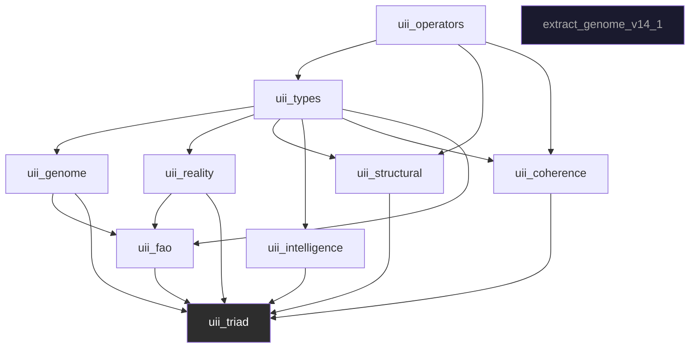
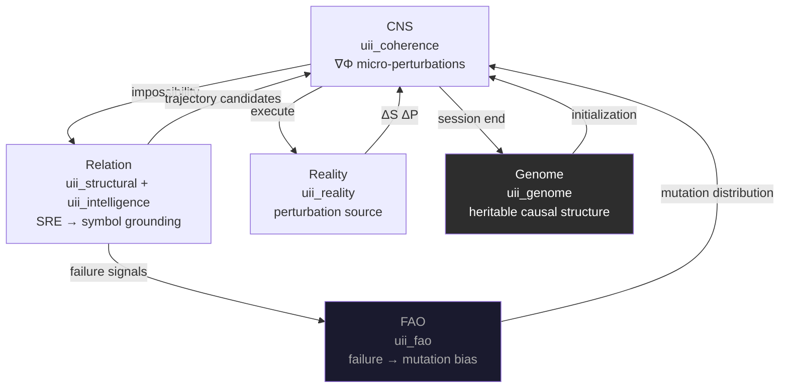
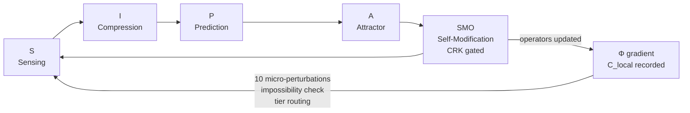

# Architecture

## Module Dependencies

```mermaid
graph TD
    OPS[uii_operators]
    TYP[uii_types]
    GEN[uii_genome]
    REA[uii_reality]
    STR[uii_structural]
    INT[uii_intelligence]
    COH[uii_coherence]
    FAO[uii_fao]
    TRI[uii_triad]
    EXT[extract_genome_v14_1]

    OPS --> TYP
    TYP --> GEN
    TYP --> REA
    TYP --> STR
    TYP --> INT
    TYP --> COH
    OPS --> STR
    OPS --> COH
    GEN --> FAO
    REA --> FAO
    TYP --> FAO
    GEN --> TRI
    REA --> TRI
    STR --> TRI
    INT --> TRI
    COH --> TRI
    FAO --> TRI

    style TRI fill:#2d2d2d,color:#fff
    style EXT fill:#1a1a2e,color:#aaa
```

---

## Mentat Triad

```mermaid
graph TD
    CNS["CNS\nuii_coherence\n∇Φ micro-perturbations"]
    REL["Relation\nuii_structural + uii_intelligence\nSRE → symbol grounding"]
    RLT["Reality\nuii_reality\nperturbation source"]
    FAO["FAO\nuii_fao\nfailure → mutation bias"]
    GEN["Genome\nuii_genome\nheritable causal structure"]

    CNS -->|impossibility| REL
    REL -->|trajectory candidates| CNS
    CNS -->|execute| RLT
    RLT -->|ΔS ΔP| CNS
    REL -->|failure signals| FAO
    FAO -->|mutation distribution| CNS
    CNS -->|session end| GEN
    GEN -->|initialization| CNS

    style GEN fill:#2d2d2d,color:#fff
    style FAO fill:#1a1a2e,color:#aaa
```

---

## Per-Step Execution Loop

```mermaid
flowchart LR
    S["S\nSensing"] --> I["I\nCompression"]
    I --> P["P\nPrediction"]
    P --> A["A\nAttractor"]
    A --> SMO["SMO\nSelf-Modification\nCRK gated"]
    SMO --> S

    SMO -->|operators updated| PHI["Φ gradient\nC_local recorded"]
    PHI -->|10 micro-perturbations\nimpossibility check\ntier routing| S
```
